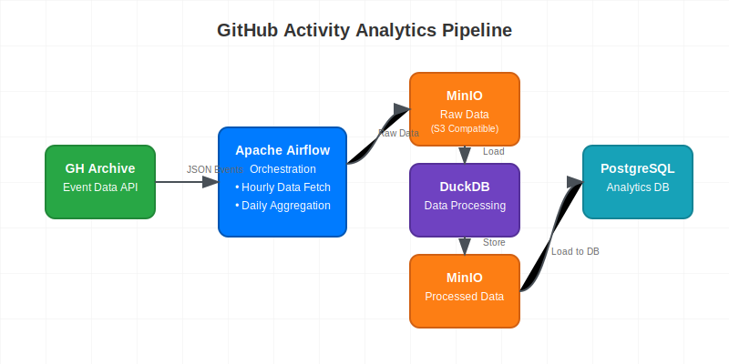

# GitHub Archive Pipeline

A simple data pipeline built with Apache Airflow to collect, process, and analyze GitHub event data from [GH Archive](https://www.gharchive.org/). The pipeline fetches hourly GitHub events, processes them through DuckDB, stores them in MinIO (S3-compatible storage), and finally loads them into Postgres for analysis.

## Architecture Overview



### Key Components

- **Apache Airflow**: Orchestrates the entire data pipeline
- **MinIO**: S3-compatible object storage for raw and cleaned data
- **DuckDB**: In-memory analytics database for data transformation
- **Postgres**: Final storage for analyzed data
- **Redis**: Message broker for Airflow's Celery executor

## Prerequisites

- Docker and Docker Compose
- Python 3.11+
- Make

## Quick Start

1. Clone the repository:
```bash
git clone <repository-url>
cd <repository-name>
```

1. Set up the environment:
```bash
make prepdir
```

1. Start the services:
```bash
make build
```

4. Access the services:
- Airflow UI: http://localhost:8080 (default credentials: airflow/airflow)
- MinIO Console: http://localhost:9001 (credentials from .env file)

## Data Processing Architecture

### DuckDB Transformation Layer

The pipeline uses DuckDB as an intermediate transformation layer, which offers several advantages:

1. **Efficient Processing**: DuckDB provides fast in-memory processing for analytical queries
2. **S3 Integration**: Direct reading from and writing to S3/MinIO
3. **Schema Evolution**: Flexible handling of JSON data with automatic schema inference
4. **Column Pruning**: Selective reading of required columns only

Key transformations performed by DuckDB:
- JSON parsing and flattening
- Data type conversions
- Column selection and renaming
- Null handling and validation

### Data Model

#### 1. Clean GitHub Archive Table
```sql
CREATE TABLE IF NOT EXISTS clean_gharchive (
    event_id BIGINT,
    event_type VARCHAR(255),
    event_created_at TIMESTAMP,
    is_public BOOLEAN,
    user_id BIGINT,
    user_login VARCHAR(255),
    user_display_login VARCHAR(255),
    repo_id BIGINT,
    repo_name VARCHAR(255),
    repo_url VARCHAR(255)
);
```

#### 2. Daily Event Summary Table
```sql
CREATE TABLE IF NOT EXISTS daily_event_summary (
    aggregation_date DATE,
    event_type VARCHAR(255),
    total_events INT,
    total_public_events INT,
    total_private_events INT,
    PRIMARY KEY (aggregation_date, event_type)
);
```

#### 3. Repository Activity Summary Table
```sql
CREATE TABLE IF NOT EXISTS repo_activity_summary (
    aggregation_date DATE,
    repo_id VARCHAR(255),
    repo_name VARCHAR(255),
    total_events INT,
    PRIMARY KEY (aggregation_date, repo_id, repo_name)
);
```

#### 4. User Activity Summary Table
```sql
CREATE TABLE IF NOT EXISTS user_activity_summary (
    aggregation_date DATE,
    user_id VARCHAR(255),
    total_events INT,
    total_public_events INT,
    total_private_events INT,
    PRIMARY KEY (aggregation_date, user_id)
);
```

### Aggregation Logic

The pipeline performs three main types of aggregations:

1. **Daily Event Summary**: 
   - Groups events by date and type
   - Calculates total, public, and private event counts
   - Uses upsert for idempotency

2. **Repository Activity**: 
   - Tracks daily activity per repository
   - Maintains repository metadata
   - Handles conflicts with updated counts

3. **User Activity**: 
   - Monitors user engagement patterns
   - Distinguishes between public and private activity
   - Provides user-level analytics

## Airflow Configuration

### DAG Design

#### 1. GitHub Archive Pipeline (`github_archive_pipeline`)
- **Schedule**: @hourly
- **Catchup**: Enabled
- **Max Active Runs**: 1
- **Purpose**: Data ingestion and transformation
- **Dependencies**: 
  - MinIO connection
  - Postgres connection
  - DuckDB configuration

#### 2. GitHub Daily Aggregators (`github_daily_aggregators_dag`)
- **Schedule**: Daily at midnight
- **Catchup**: Enabled
- **Concurrency**: 1
- **Purpose**: Data aggregation and analysis
- **SQL Template Path**: include/sql/


## Project Structure

```
.
├── dags/                # Airflow DAG definitions
├── plugins/             # Custom Airflow plugins
│   └── gh/              # GitHub-specific modules
├── include/             # SQL and other resources
│   └── sql/             # SQL query templates
├── init-scripts/        # Initialization scripts
├── logs/                # Airflow logs
├── tests/               # Test files
├── config/              # Configuration files
├── docker-compose.yml   # Docker services definition
├── Dockerfile           # Custom Airflow image definition
├── Makefile             # Development automation
└── README.md            # This file
```


## Development

### Available Make Commands

```bash
make prepdir          # Create necessary directories and .env file
make local-install    # Install Python dependencies locally
make build           # Build and start all services
make up              # Start services
make down            # Stop services
make recreate        # Recreate services
make cli             # Access Airflow container CLI
```


### Automatic Setup Process

The pipeline includes automatic initialization of required services and connections:

**Creating .env file**:

You can create a `.env` file with the following contents:
```AIRFLOW_UID=<UID>
MINIO_ROOT_USER=<your_username>
MINIO_ROOT_PASSWORD=<your_password>
```

If you don't do this, running `make up/build` will do it automatically with default values.

```bash
AIRFLOW_UID=501
MINIO_ROOT_USER=USERNAME
MINIO_ROOT_PASSWORD=PASSWORD
```


If you don't do this, running `make up/build` will do it automatically with default values.


**Database Initialization**:

Creates the `gharchive` database in Postgres

**Airflow Connections**:

The pipeline automatically configures the following connections during initialization:
- `postgres_default`: Connection to PostgreSQL database
- `aws_default`: Connection to MinIO (S3-compatible storage)

   ```bash
   # Postgres Connection
   airflow connections add 'postgres_default' \
       --conn-type 'postgres' \
       --conn-host 'postgres' \
       --conn-login 'airflow' \
       --conn-password 'airflow' \
       --conn-schema 'gharchive' \
       --conn-port 5432

   # MinIO Connection
   airflow connections add 'aws_default' \
       --conn-type 'aws' \
       --conn-login ${MINIO_ROOT_USER} \
       --conn-password ${MINIO_ROOT_PASSWORD} \
       --conn-extra "{\"endpoint_url\": \"http://host.docker.internal:9000\"}"
   ```
